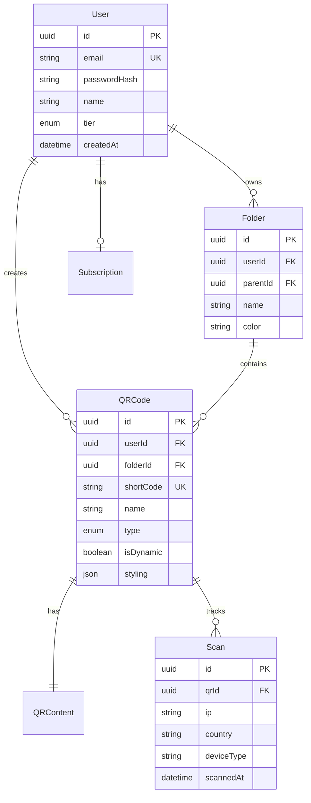

# 🏗️ System Architecture

## QRCode-Shiba Technical Architecture

**Version**: 1.0  
**Author**: Tech Lead  
**Last Updated**: 15/01/2026

---

## 1. High-Level Architecture

```
                                   ┌─────────────────────────────────────────┐
                                   │              CLIENTS                     │
                                   │  ┌─────────┐  ┌─────────┐  ┌─────────┐  │
                                   │  │   Web   │  │ Mobile  │  │   API   │  │
                                   │  │  App    │  │  App    │  │ Clients │  │
                                   │  └────┬────┘  └────┬────┘  └────┬────┘  │
                                   └───────┼───────────┼───────────┼────────┘
                                           │           │           │
                                   ┌───────▼───────────▼───────────▼────────┐
                                   │           LOAD BALANCER / CDN           │
                                   │              (Cloudflare)               │
                                   └───────────────────┬─────────────────────┘
                                                       │
                    ┌──────────────────────────────────┼──────────────────────────────────┐
                    │                                  │                                   │
                    │                         API GATEWAY                                  │
                    │                                                                      │
                    ├─────────────────────┬────────────┴────────────┬─────────────────────┤
                    │                     │                         │                      │
           ┌────────▼────────┐   ┌────────▼────────┐   ┌───────────▼──────────┐          │
           │   Auth Service  │   │   QR Service    │   │   Redirect Service   │          │
           │   (Port 3001)   │   │   (Port 3002)   │   │     (Port 3003)      │          │
           │                 │   │                 │   │                      │          │
           │ • Registration  │   │ • QR Generation │   │ • Fast Redirect      │          │
           │ • Login/JWT     │   │ • Folder Mgmt   │   │ • Scan Tracking      │          │
           │ • OAuth         │   │ • Download      │   │ • Geo/Device Info    │          │
           └────────┬────────┘   └────────┬────────┘   └──────────┬───────────┘          │
                    │                     │                        │                      │
                    │            ┌────────▼────────┐               │                      │
                    │            │ Payment Service │               │                      │
                    │            │   (Port 3004)   │               │                      │
                    │            │                 │               │                      │
                    │            │ • VNPay         │               │                      │
                    │            │ • MoMo          │               │                      │
                    │            │ • Subscriptions │               │                      │
                    │            └────────┬────────┘               │                      │
                    │                     │                        │                      │
                    └─────────────────────┼────────────────────────┘                      │
                                          │                                               │
                    ┌─────────────────────▼───────────────────────────────────────────────┤
                    │                      DATA LAYER                                      │
                    │  ┌─────────────────┐  ┌─────────────────┐  ┌─────────────────┐     │
                    │  │   PostgreSQL    │  │     Redis       │  │     MinIO       │     │
                    │  │   (Primary DB)  │  │    (Cache)      │  │   (Storage)     │     │
                    │  └─────────────────┘  └─────────────────┘  └─────────────────┘     │
                    └─────────────────────────────────────────────────────────────────────┘
```

---

## 2. Service Architecture

### 2.1 Frontend (Next.js 14)
```
apps/web/
├── app/                    # App Router
│   ├── (auth)/            # Auth pages (login, register)
│   ├── (dashboard)/       # Protected pages
│   │   └── dashboard/
│   │       ├── qr/        # QR management
│   │       ├── analytics/ # Analytics dashboard
│   │       ├── settings/  # User settings
│   │       └── folders/   # Folder management
│   └── (marketing)/       # Landing, pricing
├── components/            # Reusable components
│   ├── ui/               # Base UI components
│   └── folders/          # Folder components
└── lib/                  # Utils, API clients
```

### 2.2 Backend Services (NestJS)

#### Auth Service (Port 3001)
```
services/auth-service/
├── src/
│   ├── auth/
│   │   ├── auth.controller.ts    # REST endpoints
│   │   ├── auth.service.ts       # Business logic
│   │   ├── strategies/           # Passport strategies
│   │   │   ├── jwt.strategy.ts
│   │   │   └── google.strategy.ts
│   │   └── guards/               # Auth guards
│   └── users/                    # User management
```

#### QR Service (Port 3002)
```
services/qr-service/
├── src/
│   ├── qr/
│   │   ├── qr.controller.ts      # CRUD endpoints
│   │   ├── qr.service.ts         # QR operations
│   │   └── dto/                  # Data transfer objects
│   ├── folder/
│   │   ├── folder.controller.ts  # Folder endpoints
│   │   └── folder.service.ts     # Folder operations
│   └── generator/
│       ├── generator.service.ts  # QR generation
│       ├── styler.service.ts     # Styling/colors
│       └── renderer.service.ts   # PNG/SVG output
```

#### Redirect Service (Port 3003)
```
services/redirect-service/
├── src/
│   └── redirect/
│       ├── redirect.controller.ts  # Fast redirect
│       └── redirect.service.ts     # Scan tracking
```

#### Payment Service (Port 3004)
```
services/payment-service/
├── src/
│   ├── vnpay/                    # VNPay integration
│   ├── momo/                     # MoMo integration
│   └── subscription/             # Subscription management
```

---

## 3. Database Schema

### 3.1 Core Entities



---

## 4. Tech Stack

| Layer | Technology | Purpose |
|-------|------------|---------|
| **Frontend** | Next.js 14 | React framework with App Router |
| **Styling** | TailwindCSS | Utility-first CSS |
| **State** | Zustand | Client state management |
| **Backend** | NestJS | Node.js framework |
| **Database** | PostgreSQL | Primary data store |
| **ORM** | Prisma | Database access |
| **Cache** | Redis | Session, rate limiting |
| **Storage** | MinIO/S3 | File storage |
| **Auth** | JWT + Passport | Authentication |
| **Payments** | VNPay, MoMo | Payment processing |

---

## 5. Security Architecture

### 5.1 Authentication Flow
```
┌──────────┐     ┌──────────┐     ┌──────────┐
│  Client  │────▶│   Auth   │────▶│    DB    │
│          │     │ Service  │     │          │
│          │◀────│          │◀────│          │
└──────────┘     └──────────┘     └──────────┘
     │                │
     │ JWT Token      │
     ▼                ▼
┌──────────┐     Verify Token
│   QR     │◀────────────────
│ Service  │
└──────────┘
```

### 5.2 Security Measures
- ✅ HTTPS everywhere
- ✅ JWT with refresh tokens
- ✅ Password hashing (bcrypt)
- ✅ Rate limiting
- ✅ CORS configuration
- ✅ Input validation
- ✅ SQL injection protection (Prisma)

---

## 6. Deployment Architecture

### 6.1 Development
```
Docker Compose
├── PostgreSQL (5432)
├── Redis (6379)
├── MinIO (9000, 9001)
└── MailHog (8025)
```

### 6.2 Production (Planned)
```
AWS / GCP
├── EKS / GKE (Kubernetes)
├── RDS (PostgreSQL)
├── ElastiCache (Redis)
├── S3 (Storage)
├── CloudFront (CDN)
└── Route53 (DNS)
```

---

## 7. API Design

### 7.1 RESTful Conventions
| Method | Path | Action |
|--------|------|--------|
| GET | /api/v1/qr | List QR codes |
| POST | /api/v1/qr | Create QR code |
| GET | /api/v1/qr/:id | Get single QR |
| PATCH | /api/v1/qr/:id | Update QR |
| DELETE | /api/v1/qr/:id | Delete QR |

### 7.2 Response Format
```json
{
  "data": { ... },
  "meta": {
    "page": 1,
    "limit": 20,
    "total": 100
  }
}
```

---

*Architecture maintained by Tech Lead*
