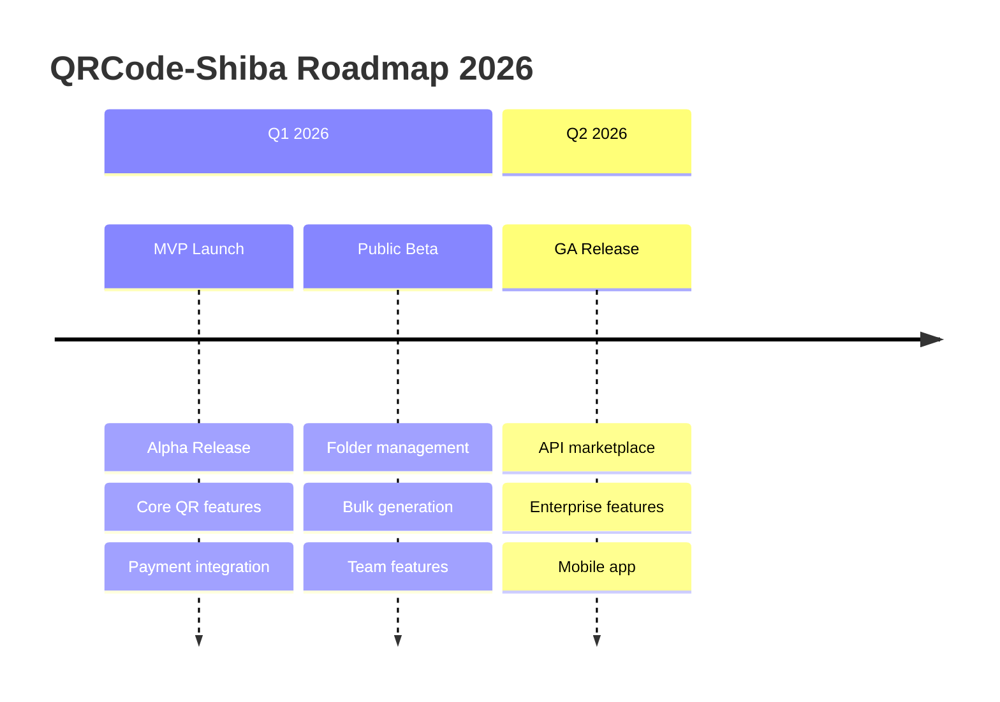

# 🎯 Milestones

## QRCode-Shiba Project Milestones

**Last Updated**: 15/01/2026

---

## 📈 Milestone Overview

---

## 🏁 Milestone 1: Alpha Release (MVP)

**Target Date**: 14/01/2026  
**Status**: ✅ **COMPLETED**

### Scope
| Feature | Status |
|---------|--------|
| User registration & login | ✅ Done |
| Google OAuth | ✅ Done |
| QR code generation (all types) | ✅ Done |
| QR styling & download | ✅ Done |
| Basic analytics | ✅ Done |
| VNPay/MoMo payments | ✅ Done |
| Subscription tiers | ✅ Done |

### Acceptance Criteria
- [x] Users can register and login
- [x] Users can create QR codes with custom styling
- [x] Users can download QR as PNG/SVG
- [x] Users can subscribe via VNPay/MoMo
- [x] Basic scan analytics available

### Metrics at Completion
| Metric | Target | Actual |
|--------|--------|--------|
| Registered users | 100 | - |
| QR codes created | 500 | - |
| Paid subscribers | 10 | - |

---

## 🏁 Milestone 2: Public Beta

**Target Date**: 27/01/2026  
**Status**: 🔄 **IN PROGRESS**

### Scope
| Feature | Status |
|---------|--------|
| Folder management | ✅ Done (Sprint 5) |
| Bulk QR generation | 🔄 Sprint 6 |
| Team collaboration | 📋 Sprint 7 |
| Enhanced analytics | 📋 Backlog |

### Acceptance Criteria
- [x] Users can organize QR codes in folders
- [ ] Users can bulk create QR from CSV
- [ ] Users can invite team members
- [ ] Teams can share QR codes
- [ ] Advanced analytics dashboard

### Metrics Target
| Metric | Target |
|--------|--------|
| Registered users | 500 |
| QR codes created | 5,000 |
| Paid subscribers | 50 |
| Team workspaces | 20 |

---

## 🏁 Milestone 3: General Availability (GA)

**Target Date**: 15/02/2026  
**Status**: 📋 **PLANNED**

### Scope
| Feature | Status |
|---------|--------|
| Public API | 📋 Sprint 8 |
| API rate limiting | 📋 Sprint 8 |
| Performance optimization | 📋 Sprint 8 |
| Mobile-responsive | 📋 Backlog |
| Email notifications | 📋 Backlog |

### Acceptance Criteria
- [ ] Developers can access public API
- [ ] API documentation available
- [ ] 99.9% uptime SLA
- [ ] Page load < 2 seconds
- [ ] Support for 10K concurrent users

### Metrics Target
| Metric | Target |
|--------|--------|
| Registered users | 2,000 |
| QR codes created | 20,000 |
| Paid subscribers | 200 |
| API integrations | 50 |

---

## 🏁 Milestone 4: Enterprise Launch

**Target Date**: 31/03/2026  
**Status**: 📋 **PLANNED**

### Scope
| Feature | Status |
|---------|--------|
| Enterprise SSO | 📋 Backlog |
| Custom domains | 📋 Backlog |
| White-label solution | 📋 Backlog |
| SLA dashboard | 📋 Backlog |
| Dedicated support | 📋 Backlog |

### Metrics Target
| Metric | Target |
|--------|--------|
| Enterprise customers | 10 |
| Monthly revenue | 50M VND |
| NPS score | > 50 |

---

## 📊 Progress Summary

| Milestone | Progress | On Track? |
|-----------|----------|-----------|
| Alpha (MVP) | 100% ✅ | ✅ Yes |
| Public Beta | 40% 🔄 | ✅ Yes |
| GA Release | 0% 📋 | ⏳ Pending |
| Enterprise | 0% 📋 | ⏳ Pending |

---

## 🚨 Risks to Milestones

| Risk | Milestone | Mitigation |
|------|-----------|------------|
| Payment gateway issues | Alpha | Multi-gateway setup ✅ |
| Performance at scale | GA | Early load testing |
| Team feature complexity | Beta | MVP scope first |
| Enterprise requirements | Enterprise | Customer discovery |

---

*Milestones tracked by PM*
