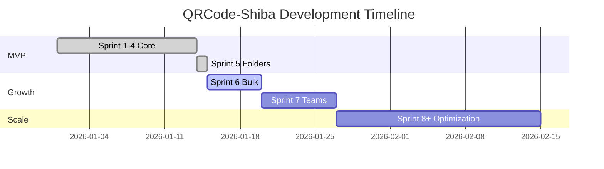

# 📋 Product Requirements Document (PRD)

## QRCode-Shiba - Nền tảng QR Code thông minh cho doanh nghiệp Việt Nam

**Version**: 1.0  
**Last Updated**: 15/01/2026  
**Author**: Product Team  
**Status**: In Development

---

## 1. Tổng quan sản phẩm

### 1.1 Vision
Trở thành nền tảng tạo và quản lý mã QR hàng đầu tại Việt Nam, phục vụ doanh nghiệp vừa và nhỏ với giải pháp toàn diện, dễ sử dụng và tích hợp thanh toán nội địa.

### 1.2 Problem Statement
- Các công cụ QR code quốc tế không hỗ trợ thanh toán VNĐ
- Thiếu tính năng theo dõi và phân tích cho doanh nghiệp Việt
- Giao diện phức tạp, không thân thiện với người dùng Việt Nam
- Chi phí cao cho các giải pháp enterprise

### 1.3 Solution
QRCode-Shiba cung cấp:
- ✅ Tạo QR code tĩnh/động với nhiều loại dữ liệu
- ✅ Theo dõi lượt quét real-time
- ✅ Phân tích chi tiết (địa lý, thiết bị, thời gian)
- ✅ Tùy chỉnh giao diện QR (màu sắc, logo)
- ✅ Thanh toán qua VNPay/MoMo
- ✅ Quản lý thư mục và bulk generation

---

## 2. Target Users

### 2.1 Primary Users
| Persona | Mô tả | Nhu cầu chính |
|---------|-------|---------------|
| **SME Owner** | Chủ doanh nghiệp vừa và nhỏ | Tạo QR cho marketing, theo dõi hiệu quả |
| **Marketing Manager** | Nhân viên marketing | Tạo QR hàng loạt, analytics |
| **Event Organizer** | Tổ chức sự kiện | QR check-in, vé điện tử |

### 2.2 Secondary Users
- Developers cần tích hợp API
- Agencies quản lý nhiều khách hàng

---

## 3. Core Features

### 3.1 QR Code Generation
| Feature | Priority | Status |
|---------|----------|--------|
| URL QR Code | P0 | ✅ Done |
| vCard QR Code | P0 | ✅ Done |
| WiFi QR Code | P0 | ✅ Done |
| Text/SMS/Email QR | P1 | ✅ Done |
| Location QR | P1 | ✅ Done |
| Dynamic QR (editable URL) | P0 | ✅ Done |
| Logo overlay | P1 | ✅ Done |
| Color customization | P1 | ✅ Done |
| Bulk generation | P2 | 🔄 Sprint 6 |

### 3.2 Management & Organization
| Feature | Priority | Status |
|---------|----------|--------|
| Folder management | P1 | ✅ Done (Sprint 5) |
| Search & filter | P1 | ✅ Done |
| Tags | P2 | 📋 Backlog |
| Team collaboration | P2 | 📋 Backlog |

### 3.3 Analytics
| Feature | Priority | Status |
|---------|----------|--------|
| Scan count | P0 | ✅ Done |
| Time-based analytics | P1 | ✅ Done |
| Geographic data | P1 | ✅ Done |
| Device/OS breakdown | P1 | ✅ Done |
| Export reports | P2 | 📋 Backlog |

### 3.4 Payments & Subscriptions
| Feature | Priority | Status |
|---------|----------|--------|
| VNPay integration | P0 | ✅ Done |
| MoMo integration | P0 | ✅ Done |
| Subscription tiers | P0 | ✅ Done |
| Invoice generation | P2 | 📋 Backlog |

---

## 4. Pricing Tiers

| Tier | Giá/tháng | QR Codes | Scans | Features |
|------|-----------|----------|-------|----------|
| **Free** | 0đ | 5 | 100/tháng | Basic styling |
| **Pro** | 99.000đ | 100 | Unlimited | Logo, folders, analytics |
| **Business** | 299.000đ | 500 | Unlimited | API, bulk, priority support |
| **Enterprise** | Custom | Unlimited | Unlimited | SLA, dedicated support |

---

## 5. Technical Requirements

### 5.1 Performance
- Page load: < 2s
- QR generation: < 500ms
- API response: < 200ms (p95)
- Uptime: 99.9%

### 5.2 Security
- HTTPS everywhere
- JWT authentication
- Rate limiting
- Data encryption at rest

### 5.3 Scalability
- Handle 10K concurrent users
- 1M QR codes per month
- 10M scans per month

---

## 6. Success Metrics

| Metric | Target (Q1 2026) |
|--------|------------------|
| Registered users | 5,000 |
| Paid subscribers | 500 |
| Monthly Active Users | 2,000 |
| QR codes created | 50,000 |
| Monthly scans | 500,000 |
| NPS Score | > 40 |

---

## 7. Risks & Mitigations

| Risk | Impact | Mitigation |
|------|--------|------------|
| Payment gateway downtime | High | Multi-gateway fallback |
| Data breach | Critical | Security audit, encryption |
| Scalability issues | Medium | Load testing, auto-scaling |
| Competition | Medium | Focus on VN market, UX |

---

## 8. Timeline Overview

---

*Document maintained by Product Team*
